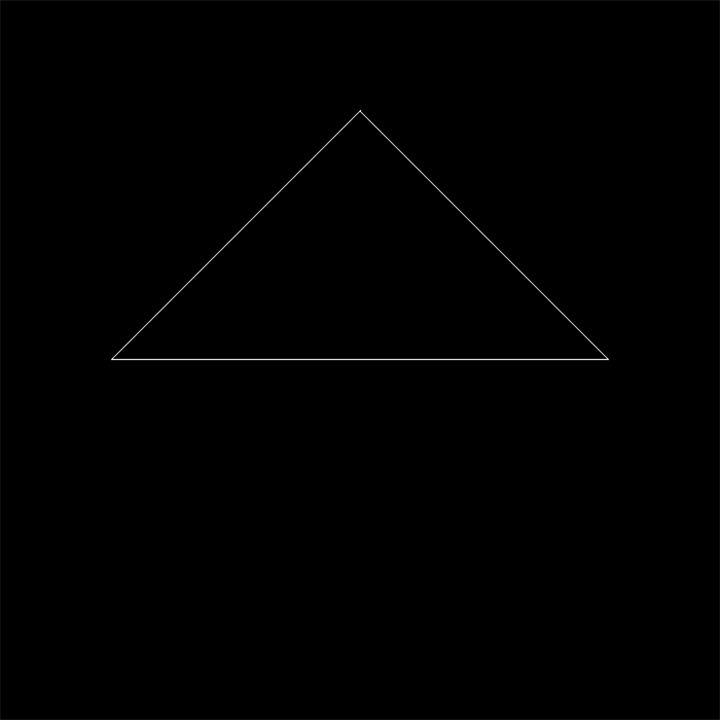
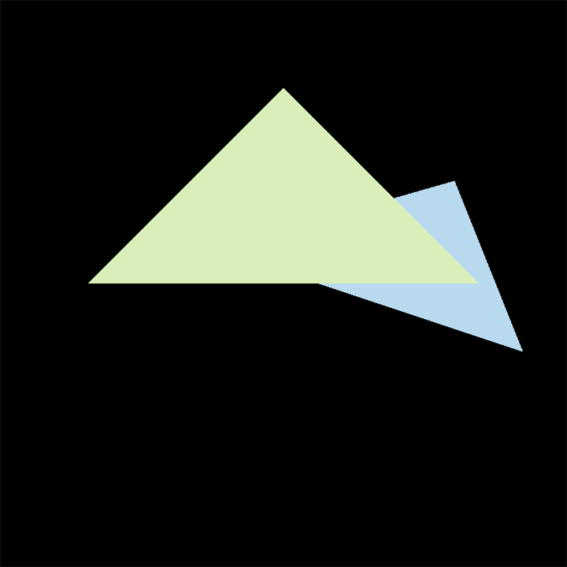
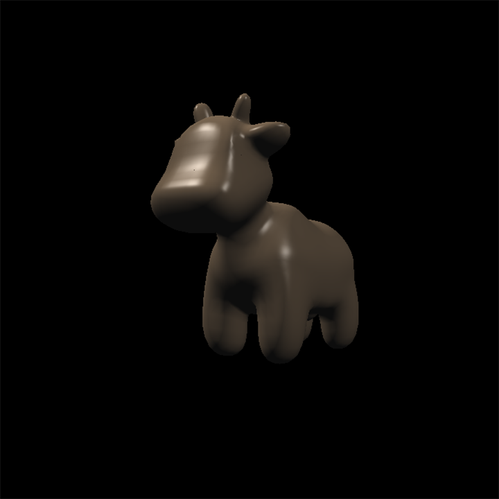
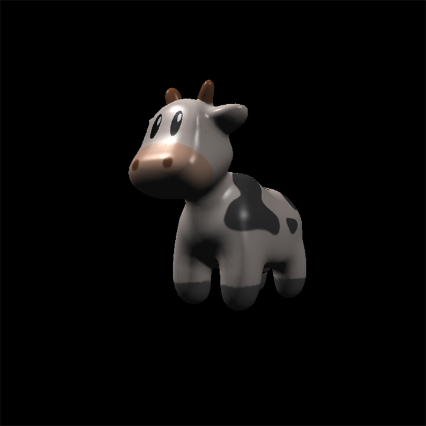
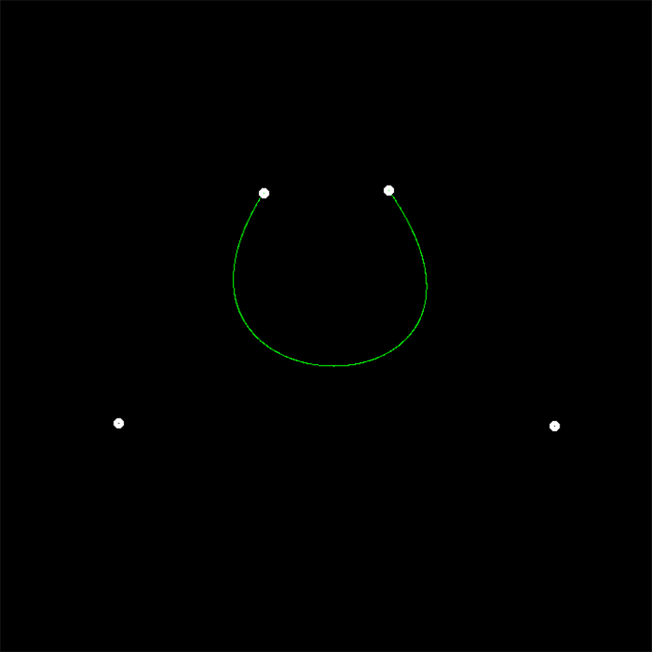
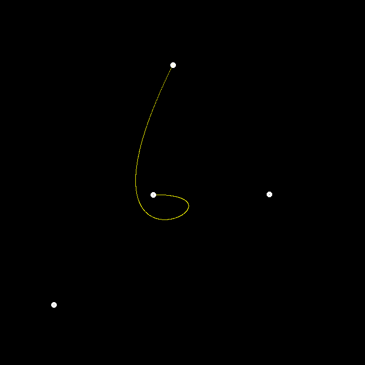
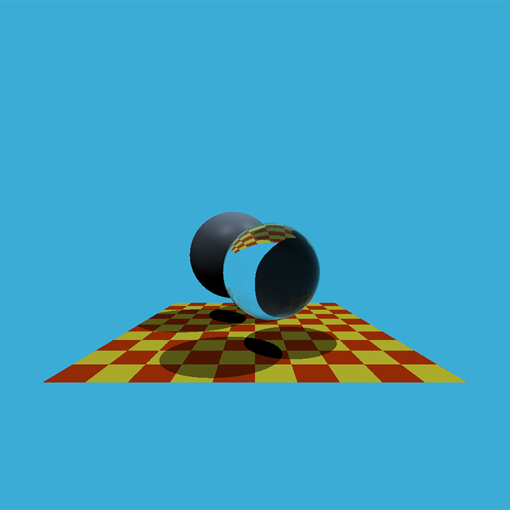
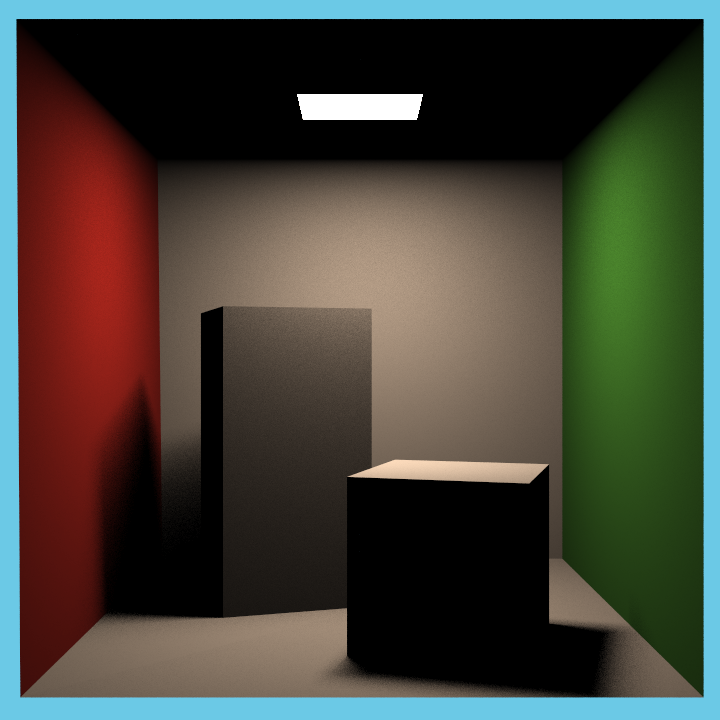
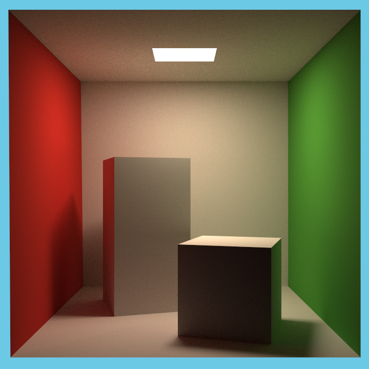

# GAMES101 Assignment

## Course Information

Course home page: [GAMES101: Introduction to Computer Graphics (in Chinese)](https://sites.cs.ucsb.edu/~lingqi/teaching/games101.html)

Course screen recording: [GAMES101-现代计算机图形学入门-闫令琪](https://www.bilibili.com/video/BV1X7411F744)

## Course Topics

<ul>
  <li>
    <details>
      <summary> Rasterization </summary>
      <table>
        <thead>
          <tr>
            <th>assignment1: Rotation and projection</th>
            <th>assignment2: Triangles and Z-buffering</th>
          </tr>
        </thead>
        <tbody>
          <tr>
            <td></td>
            <td></td>
          </tr>
        </tbody>
      </table>
      <table>
        <thead>
          <tr>
            <th>assignment3: Pipeline and Shading (Blinn-Phong shader)</th>
            <th>assignment3: Pipeline and Shading (texture shader)</th>
          </tr>
        </thead>
        <tbody>
          <tr>
            <td></td>
            <td></td>
          </tr>
        </tbody>
      </table>
    </details>
  </li>
  <li>
    <details>
      <summary>Geometry(Curves and Meshes)</summary>
      <table>
        <thead>
          <tr>
            <th>assignment4: B&#xE9;zier curve</th>
            <th>assignment4: B&#xE9;zier curve</th>
          </tr>
        </thead>
        <tbody>
          <tr>
            <td></td>
            <td></td>
          </tr>
        </tbody>
      </table>
    </details>
  </li>
  <li>
    <details>
      <summary>Ray Tracing</summary>
      <table>
        <thead>
          <tr>
            <th>assignment5: The rays intersect the triangle</th>
            <th>assignment6: Acceleration structure</th>
          </tr>
        </thead>
        <tbody>
          <tr>
            <td></td>
            <td></td>
          </tr>
        </tbody>
      </table>
      <table>
        <thead>
          <tr>
            <th>assignment7 Path-Tracing Direct-illumination SSAA SPP=1024</th>
            <th>assignment7 Path-Tracing Global-illumination SSAA SPP=1024</th>
          </tr>
        </thead>
        <tbody>
          <tr>
            <td>
            </td>
            <td>
            </td>
          </tr>
        </tbody>
      </table>
    </details>
  </li>
  <li>
    <details>
      <summary>Animation / Simulation</summary>
      WIP ···
    </details>
  </li>
</ul>

## Build And Run

```shell
# build
mkdir build
cd ./build
cmake ../
make

# run
cd build/src/assignmentX # X could be 0/1/2/3/4/5/6/7
./ExecutableFile # see more from src/assignmentX/README.md
```
